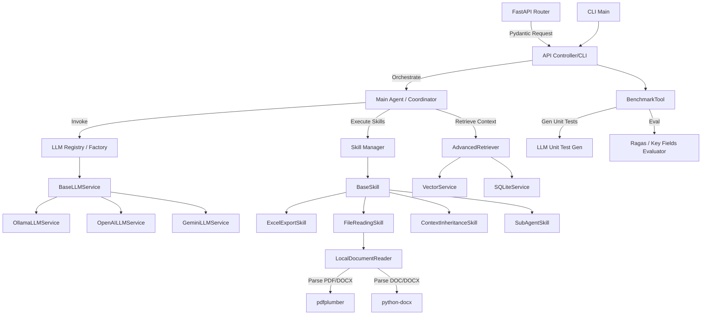
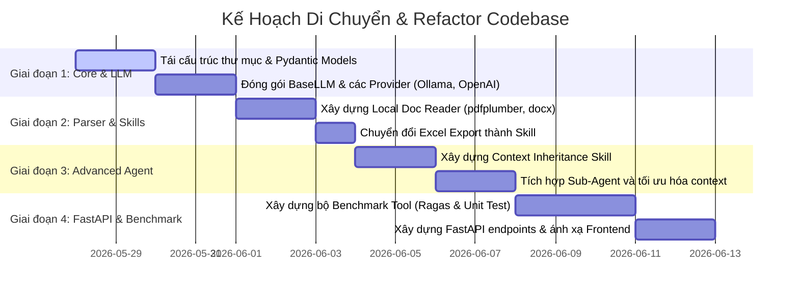

# Kế Hoạch Refactor Codebase - Testcase Generator V2

Tài liệu này trình bày kế hoạch refactor toàn diện hệ thống từ kiến trúc hiện tại (CLI & Watchdog đơn giản) sang một kiến trúc hướng đối tượng (OOP) chặt chẽ, hướng đến dịch vụ (Service-Oriented) và sẵn sàng tích hợp với FastAPI. 

Mục tiêu chính là tối ưu hóa quản lý ngữ cảnh (context management), tăng tính linh hoạt khi cấu hình các Mô hình Ngôn ngữ Lớn (LLM), sử dụng các thư viện cục bộ để xử lý tài liệu, đóng gói tính năng thành các "Skill" độc lập, và xây dựng một hệ thống benchmark đánh giá chất lượng tự động.

---

## 1. Kiến Trúc Hệ Thống Đề Xuất (System Architecture)

Dưới đây là sơ đồ tương tác giữa các thành phần sau khi refactor:



---

## 2. Chi Tiết Các Hạng Mục Refactor

### Hạng mục 1: Đóng gói lại LLM API (LLM Service Wrapper)
Hiện tại, `LLMService` chỉ hỗ trợ Ollama thông qua LangChain. Chúng ta cần đóng gói lại để dễ dàng chuyển đổi qua lại giữa các nhà cung cấp như OpenAI, Anthropic, Gemini hoặc Ollama cục bộ.

*   **Thiết kế OOP:**
    *   Tạo lớp cơ sở trừu tượng `BaseLLMService` định nghĩa các phương thức giao tiếp chuẩn (`generate`, `generate_stream`, `generate_structured`).
    *   Xây dựng các lớp kế thừa: `OllamaLLMService`, `OpenAILLMService`, `GeminiLLMService`.
    *   Sử dụng Pydantic Settings để cấu hình API Key, Endpoint, và Model Name một cách an toàn thông qua biến môi trường.
    *   Tạo `LLMFactory` để khởi tạo model dựa theo cấu hình runtime.

> [!NOTE]
> Các lớp LLM sẽ trả về đối tượng chuẩn hóa hoặc sử dụng Pydantic model cho các câu trả lời dạng JSON cấu trúc.

---

### Hạng mục 2: Chuyển việc tạo Excel sang Skill (Excel Export Skill)
Tính năng xuất Excel hiện tại đang viết trực tiếp dưới dạng hàm `export_to_excel` trong `main.py`. Chúng ta sẽ chuyển nó thành một "Skill" độc lập.

*   **Thiết kế OOP:**
    *   Định nghĩa lớp `BaseSkill` làm interface chung cho tất cả các kỹ năng của hệ thống.
    *   Xây dựng `ExcelExportSkill(BaseSkill)`.
    *   Định nghĩa Pydantic Model đầu vào cho skill: `ExcelExportInput` chứa danh sách testcases chặt chẽ.
    *   Định nghĩa Pydantic Model đầu ra: `ExcelExportOutput` chứa đường dẫn file, trạng thái và thống kê số lượng bản ghi đã tạo.

---

### Hạng mục 3: Giữ nguyên các chức năng Search & Reranking hiện tại
Giữ nguyên luồng xử lý và thuật toán tìm kiếm thông minh đã có để tránh làm suy giảm chất lượng truy hồi thông tin.

*   **Phạm vi giữ nguyên:**
    *   `EmbeddingService`: Xử lý sinh vector cho tài liệu và câu hỏi.
    *   `VectorService`: Lưu trữ và tìm kiếm vector (FAISS).
    *   `SQLiteService`: Lưu trữ dữ liệu text thô và hỗ trợ tìm kiếm từ khóa nâng cao BM25 thông qua FTS5.
    *   `AdvancedRetriever`: Sử dụng LLM để mở rộng truy vấn (MultiQuery), thực hiện tìm kiếm lai (Hybrid Search) kết hợp kết quả từ FAISS và SQLite FTS5, và cuối cùng dùng `FlashrankRerank` để rerank kết quả.
*   **Điểm refactor nhỏ:** 
    *   Đóng gói các tham số cấu hình của Retriever (như `top_k`, `rerank_model`, `cache_dir`) vào Pydantic Settings.

---

### Hạng mục 4: Đọc file PDF, DOCX bằng công cụ cục bộ (Local Document Reader)
Thay thế dịch vụ bên thứ ba Landing AI ADE (`landingai_ade`) trong `extraction_service.py` bằng các thư viện Python chạy cục bộ (local libraries) để bảo mật dữ liệu và tiết kiệm chi phí API.

*   **Giải pháp đề xuất:**
    *   Dùng **`pdfplumber`** hoặc **`pypdf`** để đọc và trích xuất văn bản/bảng biểu từ các file PDF.
    *   Dùng **`python-docx`** để xử lý các file Word (.doc, .docx).
    *   Dùng bộ parser markdown thô đối với file `.md` và `.txt`.
    *   Xây dựng lớp `LocalDocumentReader` chịu trách nhiệm tự động phát hiện định dạng file và điều phối parser tương ứng.

---

### Hạng mục 5: Skill đọc file (File Reading Skill - Tùy chọn)
Sau khi có `LocalDocumentReader`, chúng ta đóng gói tính năng này thành một Skill.

*   **Thiết kế:**
    *   Tạo lớp `FileReadingSkill(BaseSkill)`.
    *   Định nghĩa Pydantic model cho đầu vào (đường dẫn file hoặc luồng bytes tải lên từ API) và đầu ra (nội dung text thô hoặc cấu trúc Markdown, thông tin trang).
    *   Có thể tích hợp trực tiếp vào Agent hoặc Watchdog để tự động nạp dữ liệu.

---

### Hạng mục 6: Công cụ Benchmark tự động (Benchmark Tool)
Để đánh giá hiệu năng và chất lượng sinh test case của LLM, chúng ta thiết kế hệ thống benchmark với 2 hướng tiếp cận chủ đạo:

#### Hướng 1: Kiểm thử mã nguồn tự động (LLM-Generated Unit Tests)
*   **Cơ chế:** LLM sẽ đọc file đặc tả yêu cầu (Spec) và tự động sinh ra bộ mã nguồn Unit Test (Python `unittest` hoặc `pytest`).
*   **Đánh giá:** Hệ thống tự động chạy bộ unit test này đối với các testcase được tạo ra. Điểm số benchmark được đo bằng tỷ lệ test case vượt qua (pass rate) và khả năng chuẩn đoán/phân tích lỗi dựa trên các case thất bại.

#### Hướng 2: Đánh giá chất lượng sinh văn bản (RAGAS & Key Fields)
*   **Cơ chế:** Trích xuất các trường thông tin cốt lõi (như điều kiện tiên quyết, các bước thực hiện, kết quả mong đợi) từ kết quả sinh testcase (Excel hoặc JSON).
*   **Đánh giá:** Sử dụng bộ đo tiêu chuẩn **RAGAS** để tính toán các chỉ số:
    *   *Faithfulness* (Độ trung thực so với tài liệu gốc).
    *   *Answer Relevance* (Độ liên quan của câu trả lời với truy vấn).
    *   *Context Recall* (Khả năng truy hồi ngữ cảnh đầy đủ).
*   **Benchmark Hiệu năng & Trải nghiệm:**
    *   **Tốc độ (Latency):** Đo thời gian phản hồi end-to-end.
    *   **Tốc độ suy luận (Inference Speed):** Thống kê số lượng token/giây (nếu API LLM hỗ trợ).
    *   **Chỉ số hội thoại (Turns to Success):** Đo số lượng câu hỏi/chỉnh sửa mà user phải thực hiện cho đến khi xuất được file Excel ưng ý.

---

### Hạng mục 7: Skill Sub-Agent giảm tải ngữ cảnh
Đối với các tài liệu Spec lớn, việc gửi toàn bộ nội dung cho một LLM chính dễ gây tràn ngữ cảnh (context window) hoặc làm giảm chất lượng suy luận.

*   **Thiết kế OOP:**
    *   Xây dựng `SubAgentSkill(BaseSkill)` quản lý các Agent con chuyên biệt.
    *   **Drafting Agent:** Chuyên trách việc đọc từng phần Spec nhỏ và tạo bản thảo test case thô cho phần đó.
    *   **Reviewing & Formatting Agent:** Thu thập các bản thảo, kiểm tra lỗi trùng lặp, định dạng lại theo cấu trúc Pydantic chuẩn.
    *   **Context Control:** Mỗi Sub-agent chỉ được cấp đúng phần ngữ cảnh cần thiết cho nhiệm vụ của nó, giúp giảm gánh nặng context cho Main LLM.

---

### Hạng mục 8: Skill kế thừa ngữ cảnh & Tóm tắt phiên làm việc (Context Inheritance)
Khi phiên hội thoại kéo dài và sắp đạt tới giới hạn context (ví dụ: đạt 80% dung lượng `num_ctx`), hệ thống cần tự động tóm tắt để giải phóng bộ nhớ nhưng vẫn giữ được các thông tin quan trọng.

*   **Thiết kế:**
    *   Xây dựng `ContextInheritanceSkill(BaseSkill)`.
    *   **Giám sát ngữ cảnh:** Hệ thống kiểm tra tổng lượng token của lịch sử chat.
    *   **Tóm tắt trạng thái:** Khi vượt ngưỡng, skill này sẽ gửi lịch sử cho LLM tóm tắt lại các điểm chính:
        *   Tài liệu hiện tại đang làm việc là gì?
        *   Các quyết định/yêu cầu đặc biệt của người dùng là gì?
        *   Danh sách các testcase đã được xác nhận.
    *   **Kế thừa (Inheritance):** Bản tóm tắt này sẽ được dùng làm ngữ cảnh đầu vào (System Prompt / Context Block) cho phiên chat tiếp theo hoặc khi chuyển đổi mô hình LLM giữa chừng.

---

### Hạng mục 9: Quy tắc gọi Skill và Kiểm soát hội thoại (Skill Guardrails & Rule Sets)
Để ngăn chặn tình trạng LLM gọi các skill không cần thiết hoặc hỏi các câu hỏi ngoài lề (hỏi vu vơ) khi chưa có sự đồng thuận cuối cùng về dữ liệu (ví dụ: xuất file excel khi chưa thống nhất danh sách testcase), hệ thống sẽ áp dụng bộ quy tắc và cơ chế kiểm soát chặt chẽ:

*   **1. Quản lý trạng thái hội thoại (State-based Conversation Flow):**
    *   Hệ thống định nghĩa các trạng thái rõ ràng thông qua Enum: `COLLECTING_REQ` (Thu thập yêu cầu), `DRAFTING` (Sinh bản thảo), `REFINING` (User phản hồi/Tinh chỉnh), `CONFIRMING` (Chốt phương án), và `EXECUTING` (Thực thi skill).
    *   Trạng thái này được theo dõi bởi `MainAgent`. LLM chỉ được phép kích hoạt `ExcelExportSkill` khi trạng thái hội thoại đã chuyển sang `CONFIRMING` (sau khi người dùng xác nhận bằng các câu lệnh như: "Đồng ý", "Xuất file", "OK").
*   **2. Bộ quy tắc System Prompt Guardrails:**
    *   **Rule 1 - Không tự ý đoán:** Nếu thông tin đầu vào từ user mơ hồ, LLM phải đặt câu hỏi làm rõ (Clarification) thay vì tự động gọi `FileReadingSkill` hoặc tìm kiếm diện rộng.
    *   **Rule 2 - Sự đồng ý rõ ràng:** Nghiêm cấm LLM tự động gọi `ExcelExportSkill` trừ khi người dùng đã duyệt qua danh sách testcase hiển thị trên chat room và xác nhận lưu.
    *   **Rule 3 - Hạn chế hỏi ngoài lề:** Thắt chặt System Prompt với các chỉ thị giới hạn vai trò (role boundary). LLM chỉ được phản hồi trong phạm vi nghiệp vụ kiểm thử được phân công, từ chối trả lời hoặc chuyển hướng các câu hỏi ngoài phạm vi dự án.
*   **3. Bộ lọc kiểm soát tự động tại Skill Manager (Programmatic Gatekeeping):**
    *   `SkillManager` đóng vai trò là chốt chặn ở tầng code (Python). Khi LLM phát sinh một công cụ gọi (Tool Call), `SkillManager` sẽ kiểm tra chéo với trạng thái hiện tại của phiên và tính hợp lệ của dữ liệu đầu vào.
    *   Nếu LLM gọi `ExcelExportSkill` trong khi danh sách testcase trong session đang rỗng hoặc chưa qua bước review, `SkillManager` sẽ chặn cuộc gọi đó lại, trả lỗi về cho LLM và yêu cầu LLM hướng dẫn người dùng hoàn thiện danh sách trước.

---

### Hạng mục 10: Tách biệt DocWatchdog và Chuyển hướng sang Kiến trúc API-First
Khi hệ thống chuyển đổi từ ứng dụng CLI/Watchdog sang API-First phục vụ tự động hóa và tích hợp Frontend:

*   **1. Watchdog không còn là bắt buộc:** Tiến trình Watchdog giám sát thư mục vật lý cục bộ (`watchdog.py`) có thể được tắt đi để tránh lãng phí tài nguyên CPU và tránh xung đột đọc/ghi trong môi trường Container (Docker) hoặc Cloud Server.
*   **2. Đóng gói luồng thành Pipeline Service độc lập:**
    *   Xây dựng lớp dịch vụ `DocumentProcessingPipeline` đảm nhận toàn bộ luồng: *Nhận file đường dẫn/byte -> Gọi local parser -> Soạn Technical Spec -> Nạp vào SQLite FTS & Vector DB*.
    *   Cả hai thành phần **FastAPI Router** (`/v1/document` upload endpoint) và **DocWatchdog** đều sẽ import và tái sử dụng `DocumentProcessingPipeline` để xử lý tài liệu, đảm bảo tính nhất quán của dữ liệu bất kể nguồn nạp là gì.
*   **3. Cấu hình bật/tắt Watchdog linh hoạt:**
    *   Thêm biến cấu hình `ENABLE_WATCHDOG: bool = False` (mặc định là `False`) vào Pydantic Settings (`config.py`).
    *   Tại `main.py`, Watchdog chỉ được khởi chạy và giám sát thư mục khi biến cấu hình này được chuyển thành `True` (áp dụng cho môi trường chạy local để dev rảnh tay ném tài liệu vào thư mục).

---

## 3. Lộ Trình Triển Khai Từng Bước (Migration Roadmap)

Để đảm bảo codebase luôn hoạt động ổn định trong quá trình refactor, các bước sẽ được tiến hành tuần tự như sau:



### Bước 1: Chuẩn bị mô hình dữ liệu Pydantic và Cấu trúc thư mục mới
*   Tạo các schema đầu vào/đầu ra rõ ràng cho từng API và Skill tại thư mục `src/backend/app/schemas/`.
*   Điều chỉnh cấu trúc thư mục để phân biệt rõ ràng giữa `services` (dịch vụ hạ tầng), `skills` (kỹ năng của agent), và `api` (giao diện FastAPI).

### Bước 2: Triển khai Lớp Trừu Tượng LLM
*   Tạo `src/backend/app/services/llm/` chứa `base.py`, `ollama.py`, `openai.py`, `factory.py`.
*   Kiểm tra tính tương thích bằng cách thay thế trực tiếp vào `spec_generation_service.py` và `retriever_service.py`.

### Bước 3: Chuyển đổi Parser tài liệu sang cục bộ & Xây dựng Pipeline
*   Cài đặt `pdfplumber` và `python-docx` vào `requirements.txt`.
*   Tạo `src/backend/app/utils/local_reader.py` để thay thế cho `ADEExtraction` hiện tại.
*   Xây dựng lớp `DocumentProcessingPipeline` tại `src/backend/app/services/document_pipeline.py` đóng gói toàn bộ luồng xử lý tài liệu.
*   Cập nhật `DocWatchdog` và API endpoints tái sử dụng chung `DocumentProcessingPipeline` để xử lý file, đồng thời thêm biến cấu hình `ENABLE_WATCHDOG` vào Pydantic Settings để bật/tắt Watchdog linh hoạt.

### Bước 4: Đóng gói các Kỹ năng (Skills)
*   Tạo thư mục `src/backend/app/skills/` và định nghĩa `BaseSkill`.
*   Chuyển logic từ `main.py` và `extraction_service.py` sang `ExcelExportSkill` và `FileReadingSkill`.

### Bước 5: Cài đặt Quản lý Ngữ cảnh, Sub-Agent & Quy tắc gọi Skill
*   Triển khai lớp `ContextInheritanceSkill` và tích hợp vào luồng chat chính để tự động nén context.
*   Xây dựng `SubAgentSkill` hỗ trợ phân rã tác vụ.
*   Thiết lập `SkillManager` với bộ lọc kiểm soát tự động (gatekeeper) dựa trên máy trạng thái hội thoại (Conversation State Machine) để giám sát và thực thi bộ quy tắc Prompt Guardrails.

### Bước 6: Xây dựng Bộ Benchmark
*   Tạo module `src/backend/app/benchmark/` chứa code sinh unit test và công cụ đo lường RAGAS.

### Bước 7: Xây dựng API FastAPI & Đồng bộ Frontend
*   Phát triển các endpoint tại `src/backend/app/api/` sử dụng FastAPI.
*   Sử dụng Pydantic Model đã định nghĩa chặt chẽ để trả dữ liệu về cho Frontend một cách chuẩn xác.

---

## 4. Cấu Trúc Thư Mục Đề Xuất (Target Folder Structure)

```text
src/
├── backend/
│   ├── app/
│   │   ├── api/                  # FastAPI Routers & Endpoints
│   │   │   ├── v1/
│   │   │   │   ├── chat.py
│   │   │   │   ├── document.py
│   │   │   │   └── benchmark.py
│   │   │   └── deps.py
│   │   ├── core/                 # Cấu hình hệ thống & Watchdog
│   │   │   ├── config.py
│   │   │   └── watchdog.py
│   │   ├── schemas/              # Pydantic Models (Chặt chẽ, OOP)
│   │   │   ├── chat.py
│   │   │   ├── testcase.py
│   │   │   └── benchmark.py
│   │   ├── services/             # Dịch vụ nền tảng (Infrastructure Services)
│   │   │   ├── llm/
│   │   │   │   ├── __init__.py
│   │   │   │   ├── base.py
│   │   │   │   ├── ollama.py
│   │   │   │   ├── openai.py
│   │   │   │   └── factory.py
│   │   │   ├── database/
│   │   │   │   ├── vector_db.py  # Vector DB (FAISS)
│   │   │   │   └── sqlite_db.py  # SQLite FTS5
│   │   │   ├── spec_gen.py       # Soạn thảo Spec
│   │   │   └── retriever.py      # Advanced Retriever (Hybrid + Rerank)
│   │   ├── skills/               # Các kỹ năng đóng gói của Agent (OOP Skills)
│   │   │   ├── base.py
│   │   │   ├── excel_export.py
│   │   │   ├── file_reader.py
│   │   │   ├── context_inheritance.py
│   │   │   └── sub_agent.py
│   │   └── benchmark/            # Công cụ Benchmark hiệu năng & chất lượng
│   │       ├── evaluator.py
│   │       ├── unit_test_gen.py
│   │       └── ragas_metrics.py
│   ├── main.py                   # Điểm chạy CLI/App chính
│   └── requirements.txt
└── frontend/                     # Thư mục Frontend (sẽ ánh xạ API sau)
```

Tất cả các thay đổi trên sẽ tuân thủ nghiêm ngặt tính tương thích ngược, đảm bảo các tính năng cốt lõi (quét watchdog, lưu trữ vector, tìm kiếm lai, reranking) luôn hoạt động ổn định qua từng bước di chuyển.
